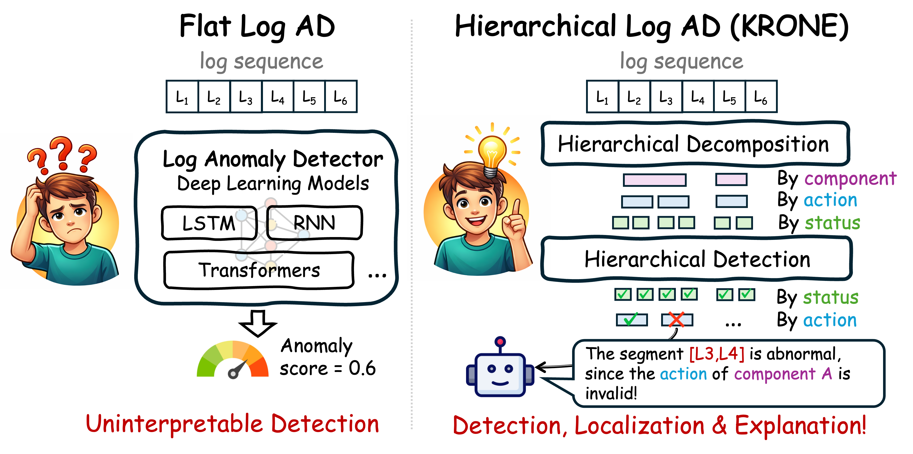
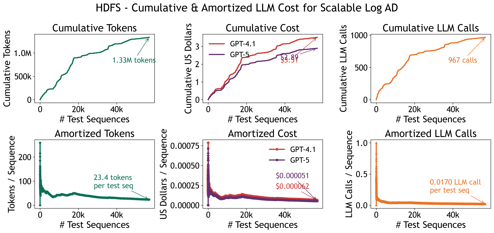
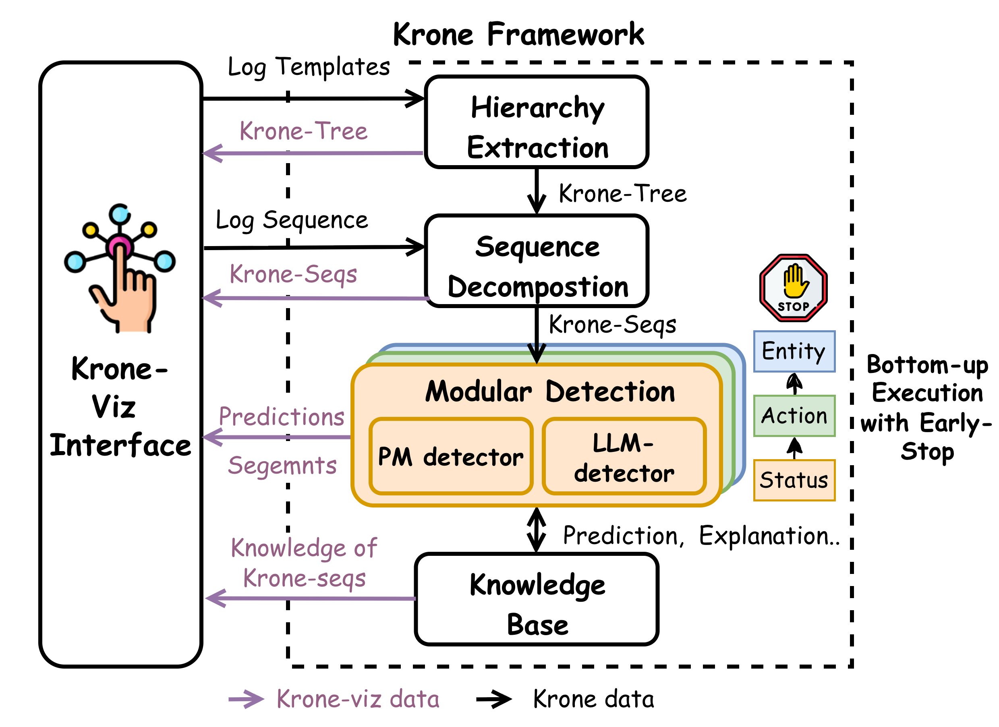

<h1 align="center">KRONE: Hierarchical and Modular Log Anomaly Detection</h1>
<h3 align="center">Accepted at ICDE 2026</h3>

<p align="center">
  <a href="https://arxiv.org/abs/2602.07303"></a>
  <a href="https://ieee-icde.org/2026/"></a>
  <a href="https://leima0324.github.io/krone/"></a>
  <a href="https://leima0324.github.io/KRONE_Demo_official/"></a>
</p>

<h2 align="center">🎮 <a href="https://leima0324.github.io/KRONE_Demo_official/">Try Our KRONE Interactive Demo!</a></h2>
<p align="center">
  Explore KRONE's hierarchical decomposition, anomaly detection, natural language explanation, and knowledge base browsing in your browser!
</p>
<p align="center">
  <a href="https://leima0324.github.io/KRONE_Demo_official/">
    
  </a>
</p>
<p align="center">
  📂 <a href="https://github.com/LeiMa0324/KRONE_Demo_official">Demo Source Code</a>
  &nbsp;|&nbsp;
  Contributors: <a href="https://github.com/suhanic44">@suhanic44</a> <a href="https://github.com/EShanbaum">@EShanbaum</a> <a href="https://github.com/atassiad">@atassiad</a>
</p>

## 🔥 Why KRONE Matters in the LLM Era

<p align="center">
  
</p>

| 💡 Cheaper detectors, sharper results | 💰 Smarter LLMs, lighter bills |
|---|---|
| **Pattern Matching** &nbsp;**42% → 88%** F1-score with or without KRONE (using only 1% training data) | **LLM detection cost** &nbsp;**$2.89 with GPT-5** on 1.1M log messages (10% HDFS) |

Plus:
- ✅ Knowledge accumulation & reuse across sequences
- ✅ Automatic anomaly localization inside log sequences
- ✅ Knowledge-grounded LLM explanations

### 🚫 Scaling LLMs is Not Enough for Log Analysis

Recent approaches increasingly apply LLMs directly to raw log sequences. However, simply scaling LLM usage introduces fundamental challenges:

- 📉 Long sequences break reasoning due to context limits and lost-in-the-middle effects  
- 💸 Per-sequence LLM inference is prohibitively expensive at production scale  
- 🧩 Flat logs lack structure, making reasoning unstable and hard to generalize  

👉 As a result, **naïve LLM-based log analysis is neither scalable nor reliable**


### 🌳 KRONE: Scaling Intelligence through Structure

Instead of treating logs as flat sequences, KRONE introduces a different perspective:

> **Log anomaly detection should be a structured, hierarchical reasoning problem**

KRONE recovers latent execution structure and enables:

- Structured reasoning over semantic execution units  
- Selective and minimal use of LLMs  
- Reusable knowledge across sequences  

### 📊 Real-World Numbers

On **56,930 HDFS test sequences (10% of whole data, 1.1 Million log messages)** with **gpt-4.1-mini**, KRONE issues only **967 LLM calls** (1.19M input / 140K output tokens) — measured cost **$0.70**. Across model tiers, KRONE delivers a consistent **~59× cost reduction**, processing the full test split for **under $3 even with gpt-5**.

#### 📉 Amortized Cost Curve

Per-sequence cost saturates as KRONE's knowledge base builds, while naive LLM usage grows linearly with the number of sequences.

<p align="center">
  
</p>

#### 💵 Cross-Model Cost Breakdown

The first row reports the actual money spent using GPT-4.1-mini; other rows project the cost of larger models using the same token usage. **Naive** = one LLM call per sequence at mean tokens (1,234 in / 145 out).

| Model | $/M in | $/M out | KRONE | Naive | ↓ |
|---|---:|---:|---:|---:|---:|
| gpt-4.1-mini *(measured)* | 0.40 | 1.60 | **$0.70** | $41.33 | ~59× |
| gpt-4.1 | 2.00 | 8.00 | **$3.51** | $206.55 | ~59× |
| gpt-5 | 1.25 | 10.00 | **$2.89** | $170.39 | ~59× |

## ✨ Highlights

### 🏗️ Framework Design
- 🌳 **Hierarchical Execution Recovery**: LLM automatically derives execution hierarchies (entity, action, status) from log templates, decomposing flat log sequences hierarchically into coherent execution chunks (KRONE-Seqs).
- 🔍 **Modular Multi-Level Detection**: Performs targeted anomaly identification at each semantic level, enabling precise localization of *where* and *why* an anomaly occurs.
- 🔌 **Detector-Agnostic**: KRONE is a general-purpose hierarchy framework — plug in any log anomaly detector and benefit from the hierarchical decomposition. **Contributions & extensions are welcome!**
- ⚡ **Hybrid Detection Strategy**: Dynamically routes between efficient local pattern matching and LLM-powered nested-aware detection, reducing LLM usage to only a small fraction of test data.


### 🤝 Knowledge Accumulation & Interpretabiliy
- 👩‍💻 **Human-Interactive Friendly**: Modular design with transparent intermediate outputs (KRONE-Tree, KRONE-Seqs, knowledge base) enables engineers to inspect, validate, results at every stage.
- 🧠 **Knowledge Caching & Reuse**: KRONE-Seq embeddings, summaries, and LLM detection results are cached and reusable across log sequences, dramatically reducing redundant LLM calls (data space 117.3x ↓, resource 43.7x ↓).

### 💰 Resource Efficiency
- 🤖 **Minimal LLM Cost**: LLM is only invoked on **1.1%–3.3%** of the test data, enabling **scalable LLM-based anomaly detection** on large-scale production logs without prohibitive API expenses.


### 🏆 Performance
- 📈 **State-of-the-Art Accuracy**: KRONE improves F1-score by 10.07% (82.76% → 92.83%) over prior methods on three public benchmarks and one industrial dataset from ByteDance Cloud.


## 📖 Overview

<p align="center">
  
</p>

Logs originate from nested component executions with clear structural boundaries, but this organization is lost when stored as flat sequences. KRONE recovers this structure by constructing a hierarchical Log Abstraction Model and performing modular anomaly detection at three abstraction levels:

```
ROOT → ENTITY → ACTION → STATUS
```

- **Entity Level**: System modules or components (e.g., `PacketResponder`, `block`)
- **Action Level**: Operations performed (e.g., `creating`, `receiving`, `terminating`)
- **Status Level**: Outcomes (e.g., `success`, `failure`, `exception`)

## 🚀 Quick Start

We provide demo sampled datasets (~20K sequences each) under `data/` for quick experimentation. 

### 📦 Prerequisites

```bash
pip: pip install pandas numpy scikit-learn sentence-transformers openai tqdm torch python-dotenv
conda: conda env create -f environment.yml
```

### 📊 Built-in Datasets

| Dataset | Domain | Description |
|---------|--------|-------------|
| **BGL** | Supercomputing | Blue Gene/L supercomputer logs |
| **HDFS** | Distributed Systems | Hadoop Distributed File System logs |
| **Thunderbird** | Supercomputing | Thunderbird system event logs |


### 🌳 Step 1: KRONE-Tree Extraction from Log Templates (LLM Required)

Extract the hierarchical KRONE-Tree structure from raw log templates using `tree_extraction/extractor.py`. The extracted tree is saved to `output/{dataset}/templates_krone_tree.csv`.

```bash
python tree_extraction/extractor.py
```

> We have included pre-extracted KRONE-Trees in the repo (output/{dataset}/template_krone_tree.csv), so you can skip this step and go directly to Step 2.

### 🔬 Step 2: Run Detection

#### Detection Modes

| Mode | Description | LLM Required |
|------|-------------|:---:|
| `local` | Automaton-based pattern matching — fast and efficient | No |
| `mix` | Hybrid: local filtering + LLM on a subset — balanced | Yes |


For local detection using pattern matching, simply run a demo script with the default config:

```bash
cd demo_main
python BGL.py
python HDFS.py
python ThunderBird.py
```

Expected results on the demo sampled datasets (20k sequences) with default local detection config:

| Dataset         | F1 | Precision | Recall | TP | FP | TN | FN |
|-----------------|------|-----------|--------|------|------|------|------|
| **HDFS**        | 0.9838 | 0.9698 | 0.9983 | 578 | 18 | 3403 | 1 |
| **BGL**         | 0.9766 | 0.9542 | 1.0000 | 1835 | 88 | 2077 | 0 |
| **ThunderBird** | 0.8368 | 0.7195 | 1.0000 | 159 | 62 | 3779 | 0 |


For LLM integrated detection, first set your OpenAI API keys in the `.env` file, and then choose the LLM config predefined in the above demo_main scripts. 


## 🗂️ Project Structure

```
KRONE_official/
├── demo_main/               # Entry points for each dataset
│   ├── BGL.py
│   ├── HDFS.py
│   └── Thunderbird.py
├── executor/                # Pipeline orchestration
│   └── executor.py
├── krone_hierarchy/         # Core krone execution orchestration
│   ├── Krone_tree.py        # Hierarchical Krone tree construction
│   ├── Node.py              # Node data structure
│   ├── Krone_seq.py         # KRONE-Seqs representation
│   ├── Krone_seq_manager.py # KRONE-Seqs management
│   ├── KnowledgeBase.py     # Knowledge base for KRONE-Seq, emebdding, summary, and LLM detection result, explanation
│   ├── Automaton_graph.py   # State machine optional detector
│   ├── PROMPTS.py           # LLM prompts
├── tree_extraction/         # Krone-tree extraction (LLM)
│   ├── extractor.py
│   └── EXTRACT_PROMPTS.py
├── llm/                    # LLM configuration (OpenAI API)
│   └── llm.py
├── data/                   # Datasets, contains the full templates and demo 20k sequences 
│   ├── BGL/
│   ├── HDFS/
│   └── ThunderBird/
├── output/                 # Results & Knowledge base content
└── utils.py                # Metrics (AUC, F1, precision, recall)
```


## 📄 Citation

If you find this work useful, please cite our paper:

```bibtex
@misc{ma2026kronehierarchicalmodularlog,
      title={KRONE: Hierarchical and Modular Log Anomaly Detection}, 
      author={Lei Ma and Jinyang Liu and Tieying Zhang and Peter M. VanNostrand and Dennis M. Hofmann and Lei Cao and Elke A. Rundensteiner and Jianjun Chen},
      year={2026},
      eprint={2602.07303},
      archivePrefix={arXiv},
      primaryClass={cs.DB},
      url={https://arxiv.org/abs/2602.07303}, 
}
```
